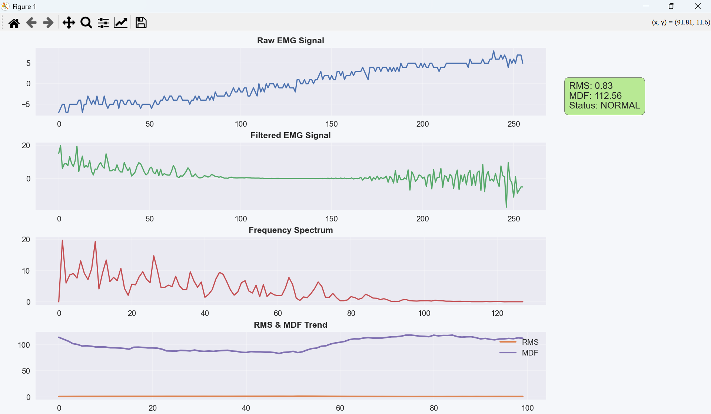
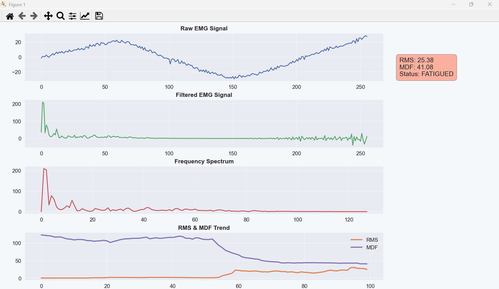

# EMG Fatigue Detection System using ESP32 + Python

Real-time EMG (Electromyography) signal acquisition, filtering, frequency analysis, and muscle fatigue detection using ESP32 and Python visualization dashboard.

---

# Features

- Real-time EMG signal acquisition using ESP32
- Double-buffered high-speed ADC sampling
- Digital signal filtering:
  - High-pass filter
  - Low-pass filter
  - 50/60Hz notch filter
- FFT-based frequency analysis
- RMS computation
- Median Frequency (MDF) extraction
- Muscle fatigue detection using MDF drop
- Live Python dashboard visualization
- JSON serial communication between ESP32 and PC

---

# System Architecture

EMG Sensor → ESP32 ADC → Signal Filtering → FFT + Feature Extraction → Serial JSON → Python Dashboard

---

# Hardware Used

- ESP32
- EMG sensor / bio-signal acquisition circuit
- Electrodes
- USB Serial Communication

---

# Software Stack

## Embedded
- Arduino IDE
- ESP32
- ArduinoFFT Library

## PC Dashboard
- Python
- matplotlib
- NumPy
- pySerial

---

# Signal Processing Pipeline

## 1. Sampling
- Sampling Frequency: `1000 Hz`
- Buffer Size: `256 samples`

## 2. Filtering
The EMG signal passes through:

### High Pass Filter
Removes motion artifacts and DC drift.

### Low Pass Filter
Suppresses high-frequency noise.

### Notch Filter
Removes powerline interference (50/60Hz).

---

# Extracted Features

## RMS (Root Mean Square)
Measures muscle activation intensity.

## MDF (Median Frequency)
Used for muscle fatigue analysis.

A decrease in MDF indicates muscle fatigue.

---

# Fatigue Detection Logic

Baseline MDF is calculated during the initial calibration period.

Fatigue condition:

```cpp
if(mdf_smooth < 0.7 * baseline_mdf)
```

If MDF drops below 70% of baseline:
- Muscle state → FATIGUED

Else:
- Muscle state → NORMAL

---

# Python Dashboard

The dashboard displays:

- Raw EMG Signal
- Filtered EMG Signal
- Frequency Spectrum (FFT)
- RMS Trend
- MDF Trend
- Fatigue Status Indicator

---
# Dashboard Preview

## Real-Time EMG Monitoring Dashboard

The system visualizes:

- Raw EMG signal
- Filtered EMG signal
- Frequency spectrum
- RMS trend
- Median Frequency (MDF) trend
- Muscle fatigue detection status

### Example Output



---

# Example Fatigue Detection

The dashboard automatically detects muscle fatigue using MDF reduction.

- Green → Normal muscle condition
- Red → Fatigued state
- Yellow → Calibration phase



# Serial Communication Format

ESP32 sends JSON packets:

```json
{
  "rms": 12.5,
  "mdf": 82.3,
  "fatigue": 0,
  "raw": [...],
  "filt": [...],
  "fft": [...]
}
```

---

# Installation

## Clone Repository

```bash
git clone https://github.com/adityakr-010/EMG-based-muscle-fatigue-detector.git
```

---

# Arduino Setup

## Install Libraries

- ArduinoFFT

## Upload Code
Upload the ESP32 firmware using Arduino IDE.

---

# Python Setup

Install dependencies:

```bash
pip install pyserial matplotlib numpy
```

Run dashboard:

```bash
python dashboard.py
```

---

# Dashboard Preview

Features:
- Live waveform plotting
- Real-time FFT visualization
- RMS & MDF monitoring
- Fatigue state visualization

---

# Applications

- Muscle fatigue monitoring
- Sports science
- Rehabilitation systems
- Human-machine interfaces
- Biomedical signal analysis
- Edge AI healthcare systems

---

# Future Improvements

- Wireless BLE streaming
- Edge AI classification
- TinyML deployment
- Cloud dashboard integration
- PCB integration
- Multi-channel EMG acquisition

---

# Author

Aditya Kumar  

---

# License

MIT License
